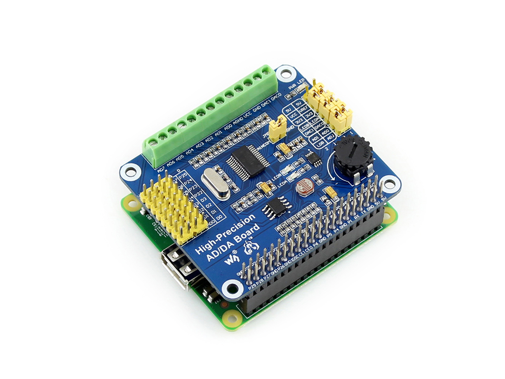
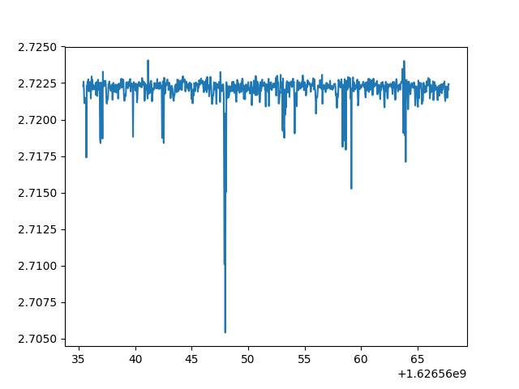

# High-Precision AD/DA Board

https://www.waveshare.com/high-precision-ad-da-board.htm  


<p align="center"> </p>


```
cd /High-Precision-AD-DA-Board/RaspberryPI/AD-DA/python
python3 main.py
```
gain
```
nano ADS1256.py
ADS1256_GAIN_E -> 'ADS1256_GAIN_64'
```
save signal file
```
python3 save.py
```

get signal file
```
scp -r pi@192.168.50.119:/home/pi/High-Precision-AD-DA-Board/RaspberryPI/AD-DA/python ./High-Precision-AD-DA-Board/
```

show signal file
```
python3 show.py
```
<p align="center"> </p>

